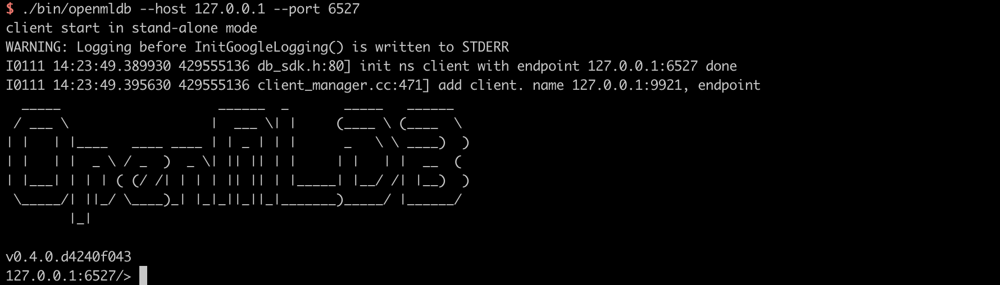

# OpenMLDB 快速上手

本教程提供OpenMLDB快速上手指南。通过建立数据库、导入数据、离线特征计算、SQL 方案上线、在线实时特征计算，演示了集群版OpenMLDB和单机版OpenMLDB的基本使用流程。

## 1. 集群版OpenMLDB 快速上手

本教程均基于 OpenMLDB CLI 进行开发和部署，因此首先需要下载样例数据并且启动 OpenMLDB CLI。

### 1.1 环境和样例数据

#### 1.1.1 样例数据

```bash
> mkdir data
> curl https://raw.githubusercontent.com/4paradigm/OpenMLDB/main/demo/standalone/data/data.csv --output ./data/data.csv
```

#### 1.1.2 下载和启动Zookeeper

- 下载zookeeper安装包

```
> wget https://archive.apache.org/dist/zookeeper/zookeeper-3.4.14/zookeeper-3.4.14.tar.gz
> tar -xzvf zookeeper-3.4.14.tar.gz
> cd zookeeper-3.4.14
```

- 配置Zookpeer端口号：默认配置zookeeper端口2181，若与你的系统冲突，请选择其他端口。

```
> vi conf/zoo.cof
# The number of milliseconds of each tick
tickTime=2000
# The number of ticks that the initial
# synchronization phase can take
initLimit=10
# The number of ticks that can pass between
# sending a request and getting an acknowledgement
syncLimit=5
# the directory where the snapshot is stored.
# do not use /tmp for storage, /tmp here is just
# example sakes.
dataDir=/tmp/rambuild/ut_zookeeper
# the port at which the clients will connect
clientPort=2181
```

- 启动Zookeeper

```
./bin/zkServer.sh start
```

#### 1.1.3 下载和启动集群版OpenMLDB服务

```bash
> wget https://github.com/4paradigm/OpenMLDB/releases/download/0.3.2/openmldb-0.3.2-linux.tar.gz
> tar -zxvf openmldb-0.3.2-linux.tar.gz
> mv openmldb-0.3.2-linux openmldb
> cd openmldb
> ./bin/start-all.sh
```

请注意:warning:：我们使用默认的nameserver, tablet以及apiserver配置，如果配置的端口和你当前系统的端口有冲突，请修改相关配置。具体配置文件和修改方式请参考[集群版OpenMLDB部署与配置](../deploy/install_deploy.md#部署集群版)

#### 1.1.4 启动集群版OpenMLDB CLI客户端

```bash
# Start the OpenMLDB CLI for the cluster deployed OpenMLDB
> bin/openmldb/bin/openmldb --zk_cluster=127.0.0.1:2181 --zk_root_path=/openmldb --role=sql_client
```

以下截图显示正确启动集群版OpenMLDB CLI 以后的画面


### 1.2 基本使用流程

集群版OpenMLDB的工作流程一般包含：建立数据库和表、离线数据准备、离线特征计算、SQL 方案上线、在线数据准备、在线实时特征计算几个阶段。

⚠️与单机版OpenMLDB不同，集群版OpenMLDB需要分别管理离线数据和在线数据。具体来说，先准备离线数据，完成SQL上线后，再准备上线数据。

:bulb: 以下演示的命令如无特别说明，默认均集群版部署OpenMLDB CLI 下执行（CLI 命令以提示符 `>` 开头以作区分）。

#### 1.2.1 创建数据库和表

```sql
> CREATE DATABASE demo_db;
> USE demo_db;
> CREATE TABLE demo_table1(c1 string, c2 int, c3 bigint, c4 float, c5 double, c6 timestamp, c7 date);
```

查看数据表:

```sql
> desc demo_table1;
 --- ------- ----------- ------ ---------
  #   Field   Type        Null   Default
 --- ------- ----------- ------ ---------
  1   c1      Varchar     YES
  2   c2      Int         YES
  3   c3      BigInt      YES
  4   c4      Float       YES
  5   c5      Double      YES
  6   c6      Timestamp   YES
  7   c7      Date        YES
 --- ------- ----------- ------ ---------
 --- -------------------- ------ ---- ------ ---------------
  #   name                 keys   ts   ttl    ttl_type
 --- -------------------- ------ ---- ------ ---------------
  1   INDEX_0_1641939290   c1     -    0min   kAbsoluteTime
 --- -------------------- ------ ---- ------ ---------------
```

#### 1.2.2 离线数据准备

首先，请切换到离线执行模式。在该模式下，只会处理离线数据导入/插入以及查询操作。

接着，导入之前下载的样例数据（在 [1.1.1 样例数据](#1.1.1#样例数据) 中已经下载）作为离线数据，用于离线特征计算。

```sql
> USE demo_db;
> SET @@execute_mode='offline';
> LOAD DATA INFILE 'data/data.csv' INTO TABLE demo_table1;
```

预览离线数据

```sql
> USE demo_db;
> SET @@execute_mode='offline';
> SELECT * FROM demo_table1 LIMIT 10;
> SHOW JOBS;
 ----- ---- ---- ---------- ----------- --------------- ------------
  c1    c2   c3   c4         c5          c6              c7
 ----- ---- ---- ---------- ----------- --------------- ------------
  aaa   12   22   2.200000   12.300000   1636097390000   2021-08-19
  aaa   11   22   1.200000   11.300000   1636097290000   2021-07-20
  dd    18   22   8.200000   18.300000   1636097990000   2021-06-20
  aa    13   22   3.200000   13.300000   1636097490000   2021-05-20
  cc    17   22   7.200000   17.300000   1636097890000   2021-05-26
  ff    20   22   9.200000   19.300000   1636098000000   2021-01-10
  bb    16   22   6.200000   16.300000   1636097790000   2021-05-20
  bb    15   22   5.200000   15.300000   1636097690000   2021-03-21
  bb    14   22   4.200000   14.300000   1636097590000   2021-09-23
  ee    19   22   9.200000   19.300000   1636097000000   2021-01-10
 ----- ---- ---- ---------- ----------- --------------- ------------
```

#### 1.2.3 离线特征计算

执行 SQL进行 特征抽取，并且将生成的特征存储在一个文件中，供后续的模型训练使用。

```sql
> USE demo_db;
> SET @@execute_mode='offline';
> SELECT c1, c2, sum(c3) OVER w1 AS w1_c3_sum FROM demo_table1 WINDOW w1 AS (PARTITION BY demo_table1.c1 ORDER BY demo_table1.c6 ROWS BETWEEN 2 PRECEDING AND CURRENT ROW) INTO OUTFILE '/tmp/feature.csv';
```

#### 1.2.4 SQL 方案上线

将探索好的SQL方案部署到线上，注意部署上线的 SQL 方案需要与对应的离线特征计算的 SQL 方案保持一致。

```sql
> DEPLOY demo_data_service SELECT c1, c2, sum(c3) OVER w1 AS w1_c3_sum FROM demo_table1 WINDOW w1 AS (PARTITION BY demo_table1.c1 ORDER BY demo_table1.c6 ROWS BETWEEN 2 PRECEDING AND CURRENT ROW);
```

上线后可以通过命令 `SHOW DEPLOYMENTS` 查看已部署的 SQL 方案；

```sql
> SHOW DEPLOYMENTS;
 --------- -------------------
  DB        Deployment
 --------- -------------------
  demo_db   demo_data_service
 --------- -------------------
1 row in set
```

#### 1.2.5 在线数据准备

首先，请切换到**在线**执行模式。在该模式下，只会处理在线数据导入/插入以及查询操作。接着在在线模式下，导入之前下载的样例数据（在 [1.1 样例数据准备](#1.1 样例数据准备) 中已经下载）作为在线数据，用于在线特征计算。

```sql
> USE demo_db;
> SET @@execute_mode='online';
> LOAD DATA INFILE 'data/data.csv' INTO TABLE demo_table1;

```

预览在线数据：

```sql
> USE demo_db;
> SET @@execute_mode='online';
> SELECT * FROM demo_table1 LIMIT 10;
 ----- ---- ---- ---------- ----------- --------------- ------------
  c1    c2   c3   c4         c5          c6              c7
 ----- ---- ---- ---------- ----------- --------------- ------------
  aaa   12   22   2.200000   12.300000   1636097390000   2021-08-19
  aaa   11   22   1.200000   11.300000   1636097290000   2021-07-20
  dd    18   22   8.200000   18.300000   1636097990000   2021-06-20
  aa    13   22   3.200000   13.300000   1636097490000   2021-05-20
  cc    17   22   7.200000   17.300000   1636097890000   2021-05-26
  ff    20   22   9.200000   19.300000   1636098000000   2021-01-10
  bb    16   22   6.200000   16.300000   1636097790000   2021-05-20
  bb    15   22   5.200000   15.300000   1636097690000   2021-03-21
  bb    14   22   4.200000   14.300000   1636097590000   2021-09-23
  ee    19   22   9.200000   19.300000   1636097000000   2021-01-10
 ----- ---- ---- ---------- ----------- --------------- ------------
```

:bulb: 注意：

- 单机部署版的OpenMLDB不同，集群版的OpenMLDB需要分别维护离线和在线数据。
- 一般而言，用户需要成功完成SQL上线部署后，才能准备上线数据。否则可能会上线失败。

#### 1.2.6 退出 CLI

```sql
> quit;
```

至此我们已经完成了全部基于集群版OpenMLDB CLI 的开发部署工作，并且已经回到了操作系统命令行下。

#### 1.2.6 实时特征计算

注意:warning:: 按照默认的部署配置，apiserver部署的http端口为9080。

实时线上服务可以通过如下 Web API 提供服务：

```
http://127.0.0.1:9080/dbs/demo_db/deployments/demo_data_service
        \___________/      \____/              \_____________/
              |               |                        |
        APIServer地址     Database名字            Deployment名字
```

实时请求的输入数据接受 `json` 格式，我们把一行数据放到请求的 `input` 域中。如下示例:

```bash
curl http://127.0.0.1:9080/dbs/demo_db/deployments/demo_data_service -X POST -d'{"input": [["aaa", 11, 22, 1.2, 1.3, 1635247427000, "2021-05-20"]]}'
```

如下为该查询预期的返回结果（计算得到的特征被存放在 `data` 域）：

```json
{"code":0,"msg":"ok","data":{"data":[["aaa",11,22]],"common_cols_data":[]}}
```


## 2. 单机部署版OpenMLDB 快速上手

本教程均基于 OpenMLDB CLI 进行开发和部署，因此首先需要下载样例数据并且启动 OpenMLDB CLI。

### 2.1环境和数据准备

#### 2.1.1 样例数据

```bash
> mkdir data
> curl https://raw.githubusercontent.com/4paradigm/OpenMLDB/main/demo/standalone/data/data.csv --output ./data/data.csv
```

#### 2.1.2 下载和启动单机版OpenMLDB服务

@chen jing docker

```bash
> wget https://github.com/4paradigm/OpenMLDB/releases/download/0.3.2/openmldb-0.3.2-linux.tar.gz
> tar -zxvf openmldb-0.3.2-linux.tar.gz
> mv openmldb-0.3.2-linux openmldb
> cd openmldb
> ./bin/start-standalone.sh
```

请注意:warning:：我们使用默认的nameserver, tablet以及apiserver配置，如果配置的端口和你当前系统的端口有冲突，请修改相关配置。具体配置文件和修改方式请参考[单机版OpenMLDB部署与配置](../deploy/install_deploy.md#部署单机版)

#### 2.1.3 启动单机版OpenMLDB CLI客户端

```bash
# Start the OpenMLDB CLI for the cluster deployed OpenMLDB
> bin/openmldb --host 127.0.0.1 --port 6527
```

以下截图显示了以上 docker 内命令正确执行以及 OpenMLDB CLI 正确启动以后的画面



### 2.2 基本使用流程

单机版OpenMLDB的工作流程一般包含：建立数据库和表、数据准备、离线特征计算、SQL 方案上线、在线实时特征计算几个阶段。

⚠️与集群版OpenMLDB不同，单机版本只需要管理一份数据用于离线和在线特征计算。

:bulb: 以下演示的命令如无特别说明，默认均在单机版OpenMLDB CLI 下执行（CLI 命令以提示符 `>` 开头以作区分）。

#### 2.2.1 创建数据库和表

```sql
> CREATE DATABASE demo_db;
> USE demo_db;
> CREATE TABLE demo_table1(c1 string, c2 int, c3 bigint, c4 float, c5 double, c6 timestamp, c7 date);
```

#### 2.2.2 数据准备

导入之前下载的样例数据（在 [2.1.1 样例数据](#2.1.1-样例数据) 中已经下载）作为训练数据，用于离线和在线特征计算。⚠️与集群版OpenMLDB不同，单机版本只需要管理一份数据用于离线和在线特征计算。

```sql
> LOAD DATA INFILE 'data/data.csv' INTO TABLE demo_table1;
```

预览数据

```sql
> SELECT * FROM demo_table1 LIMIT 10;
 ----- ---- ---- ---------- ----------- --------------- ------------
  c1    c2   c3   c4         c5          c6              c7
 ----- ---- ---- ---------- ----------- --------------- ------------
  aaa   12   22   2.200000   12.300000   1636097390000   2021-08-19
  aaa   11   22   1.200000   11.300000   1636097290000   2021-07-20
  dd    18   22   8.200000   18.300000   1636097990000   2021-06-20
  aa    13   22   3.200000   13.300000   1636097490000   2021-05-20
  cc    17   22   7.200000   17.300000   1636097890000   2021-05-26
  ff    20   22   9.200000   19.300000   1636098000000   2021-01-10
  bb    16   22   6.200000   16.300000   1636097790000   2021-05-20
  bb    15   22   5.200000   15.300000   1636097690000   2021-03-21
  bb    14   22   4.200000   14.300000   1636097590000   2021-09-23
  ee    19   22   9.200000   19.300000   1636097000000   2021-01-10
 ----- ---- ---- ---------- ----------- --------------- ------------
```

#### 2.2.3 离线特征计算

执行 SQL进行 特征抽取，并且将生成的特征存储在一个文件中，供后续的模型训练使用。

```sql
> SELECT c1, c2, sum(c3) OVER w1 AS w1_c3_sum FROM demo_table1 WINDOW w1 AS (PARTITION BY demo_table1.c1 ORDER BY demo_table1.c6 ROWS BETWEEN 2 PRECEDING AND CURRENT ROW) INTO OUTFILE '/tmp/feature.csv';
```

#### 2.2.4 SQL 方案上线

将探索好的SQL方案部署到线上，注意部署上线的 SQL 方案需要与对应的离线特征计算的 SQL 方案保持一致。

```sql
> DEPLOY demo_data_service SELECT c1, c2, sum(c3) OVER w1 AS w1_c3_sum FROM demo_table1 WINDOW w1 AS (PARTITION BY demo_table1.c1 ORDER BY demo_table1.c6 ROWS BETWEEN 2 PRECEDING AND CURRENT ROW);
```

上线后可以通过命令 `SHOW DEPLOYMENTS` 查看已部署的 SQL 方案；

```sql
> SHOW DEPLOYMENTS;
 --------- -------------------
  DB        Deployment
 --------- -------------------
  demo_db   demo_data_service
 --------- -------------------
1 row in set
```

:bulb: 注意，单机部署的OpenMLDB使用了同一份数据做线下和线上特征计算。

#### 2.2.5 退出 CLI

```sql
> quit;
```

至此我们已经完成了全部基于 OpenMLDB CLI 的开发部署工作，并且已经回到了操作系统命令行下。

#### 2.2.6 实时特征计算

实时线上服务可以通过如下 Web API 提供服务：

```
http://127.0.0.1:8080/dbs/demo_db/deployments/demo_data_service
        \___________/      \____/              \_____________/
              |               |                        |
        APIServer地址     Database名字            Deployment名字
```

实时请求的输入数据接受 `json` 格式，我们把一行数据放到请求的 `input` 域中。如下示例:

```bash
curl http://127.0.0.1:8080/dbs/demo_db/deployments/demo_data_service -X POST -d'{"input": [["aaa", 11, 22, 1.2, 1.3, 1635247427000, "2021-05-20"]]}'
```

如下为该查询预期的返回结果（计算得到的特征被存放在 `data` 域）：

```json
{"code":0,"msg":"ok","data":{"data":[["aaa",11,22]],"common_cols_data":[]}}
```

