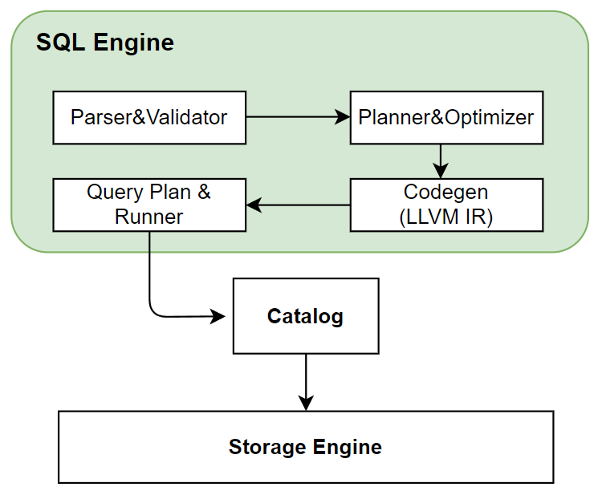

# 在线模块架构

## 1. 概览

OpenMLDB 的在线架构的主要模块包括 Apache ZooKeeper, Nameserver 以及 Tablets（包含了SQL Engine 和 Storage Engine）。如下图显示了这些模块之间的相互关系。其中 Tablets 是整个 OpenMLDB 存储和计算的核心模块，也是消耗资源做多的模块；ZooKeeper 和 Nameserver 主要用于辅助功能，如元数据的管理和高可用等。本文以下将会详细介绍各个模块的作用。

## 2. Apache ZooKeeper
OpenMLDB 依赖 ZooKeeper 做服务发现和元数据存储和管理功能。ZooKeeper 和 OpenMLDB SDK，Tables, Namesever 之间都会存在交互，用于分发和更新元数据。

## 3. Nameserver
Nameserver 主要用来做 Tablet 管理以及故障转移（failover）。当一个 Tablet 节点宕机后，Nameserver 就会触发一系列任务来执行故障转移，当节点恢复后会重新把数据加载到该节点中。故障转移和数据恢复是以分片（partition）为单位的，Storage Engine 部分有分片的详细介绍。

同时，为了保证 Nameserver 本身的高可用，Nameserver 在部署时会部署多个实例，采用了 primary/secondary 节点的部署模式，同一时刻只会有一个 primary 节点。多个 Nameserver 通过 ZooKeeper 实现 primary 节点的抢占。因此，如果当前的 primary 节点以外离线，则 ZooKeeper 会从 secondary 节点中选一个重新作为 primary 节点。

## 4. Tablets
Tablet 是 OpenMLDB 用来执行 SQL 和数据存储的模块，也是整个 OpenMLDB 功能实现的核心以及资源占用的瓶颈。Tablet 从功能上来看，进一步包含了 SQL 引擎和存储引擎两个模块。Tablet 也是 OpenMLDB 部署资源的可调配的最小粒度，一个 Tablet 需要完整的部署到一个物理节点；同时一个物理节点上可以有多个 Tablets。
### 4. 1 SQL Engine
SQL Engine 收到 SQL 的请求后的执行过程如下图所示：

SQL 引擎通过 [ZetaSQL](https://github.com/4paradigm/zetasql) 把SQL解析成AST语法树。因为我们加入了 `LAST JOIN`，`WINDOW UNION` 等针对特征工程扩展的特殊 SQL 语法，所以对开源的 ZetaSQL 做了优化。经过如上图一系列的编译转化、优化，以及基于 LLVM 的 codegen 之后，最终生成执行计划。SQL 引擎基于执行计划，通过 Catalog 获取存储层数据做最终的 SQL 执行运算。在分布式版本中，会生成分布式的执行计划，会把执行任务发到其他 Tablet 节点上执行。目前 OpenMLDB 的 SQL 引擎采用 Push 的模式，将任务分发到数据所在的节点执行，而不是将数据拉回来。这样做的好处可以减少数据传输。

### 4.2 Storage Engine
#### 数据分布
OpenMLDB 集群版是一个分布式的数据库，一张表的数据会进行分片（partition），并且建立多个副本，最终分布在不同的节点中。这里展开说明两个主要的概念：副本和分片。

- 副本：为了保证高可用以及提升分布式查询的效率，数据表将会在 OpenMLDB 内存放多个拷贝，这些拷贝就叫做副本。

- 分片：一张表（或者具体为一个副本）在具体存储时，会进一步被切割为多个分片。分片数据可以在创建表时指定，但是一旦创建好，分片数就不能动态修改了。分片是存储引擎主从同步以及扩缩容的最小单位。一个分片可以灵活的在不同的 Tablet 之间实现迁移。

如下图显示了两个数据表，在三个 Tablets上，做三副本，每个表做四分片的情况下的存储布局。可以看到，

一张表的多个分片分布在不同节点上，一个节点上既有主分片又有从分片(分片内部的数据存储在后续博文中会专门介绍)。OpenMLDB内部通过一定策略保证分片均匀分布到各个tablet上。
    
    读写数据时通过哈希函数计算要访问哪个分片，然后把请求发到对应的tablet节点上。

#### 数据持久化及主从同步
OpenMLDB的在线数据全部保存在内存中，为了实现高可用会把数据持久化到硬盘中。

服务端收到SDK的写请求后会写内存和binlog。binlog是用来做主从同步的，数据写到binlog后会有一个后台线程异步的把数据从binlog中读出来然后同步到从节点中。从节点收到同步请求后同样是写内存和binlog。  
snapshot可以看作是内存数据的一个镜像，不过出于性能考虑，snapshot并不是从内存dump出来，而是由binlog和上一个snapshot合并生成。在合并的过程中会删除掉过期的数据。OpenMLDB会记录主从同步和合并到snapshot中的offset, 如果一个binlog文件中的数据全部被同步到从节点并且也合并到了snapshot中，这个binlog文件就会被后台线程删除。
