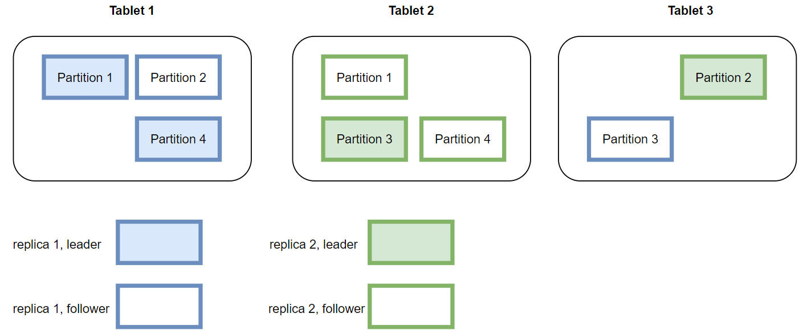

# 在线架构

## 1. 概览

OpenMLDB 的线上架构的主要模块包括 Apache ZooKeeper, Nameserver, Tablet, 执行引擎，存储引擎等。

## Zookeeper
OpenMLDB依赖[Zookeeper](https://zookeeper.apache.org/)做服务发现和元数据存储。

## Nameserver
nameserver主要用来做tablet管理以及failover的。当一个tablet节点宕机后，nameserver触发一系列任务来执行故障转移，如果节点恢复后会把数据加载到该节点中。故障转移和数据恢复是以分片为单位的，后面会有分片的详细介绍。

为了保证nameserver的高可用，nameserver在部署时会部署多个，是master/standby的模式，同一时刻只会有一个master。多个nameserver借助zookeeper实现抢主。如果其中一个master节点挂掉，会从standby中选一个作为master。

## Tablet
tablet是用来执行sql和数据存储的模块。
### 执行引擎
OpenMLDB执行引擎收到SQL请求后的执行过程如下图所示：

现在执行引擎里是通过[zetasql](https://github.com/4paradigm/zetasql)把SQL解析成AST语法树的。因为我们加入了一些类似`LAST JOIN`之类的特有SQL语法，所以对开源的zetasql做了一些修改。经过一系列转化和优化以及LLVM codegen之后就会生成执行计划，通过Catalog获取存储层数据做SQL运算。在分布式版本中，会生成分布式的执行计划，会把一些执行任务发到其他tablet节点上执行。目前OpenMLDB执行引擎采用Push的模式，将任务分发到数据所在的节点执行，而不是将数据拉回来。这样做的好处可以减少数据传输。

### 存储引擎
#### 数据分布
和MySQL类似，在OpenMLDB中也有database和table。一张table必须关联到一个database中，一个database可以创建多张表。OpenMLDB是一个分布式的数据库，一张表的数据会分布在不同的节点中。一张表分为多个分片(Partition)，默认为8个，也可以在创建表时指定。表一旦创建好，分片数就不能动态修改了。分片是存储引擎主从同步以及扩缩容的最小单位。如下图所示，一张表的多个分片分布在不同节点上，一个节点上既有主分片又有从分片(分片内部的数据存储在后续博文中会专门介绍)。OpenMLDB内部通过一定策略保证分片均匀分布到各个tablet上。

读写数据时通过哈希函数计算要访问哪个分片，然后把请求发到对应的tablet节点上。

#### 数据持久化及主从同步
OpenMLDB的在线数据全部保存在内存中，为了实现高可用会把数据持久化到硬盘中。

服务端收到SDK的写请求后会写内存和binlog。binlog是用来做主从同步的，数据写到binlog后会有一个后台线程异步的把数据从binlog中读出来然后同步到从节点中。从节点收到同步请求后同样是写内存和binlog。  
snapshot可以看作是内存数据的一个镜像，不过出于性能考虑，snapshot并不是从内存dump出来，而是由binlog和上一个snapshot合并生成。在合并的过程中会删除掉过期的数据。OpenMLDB会记录主从同步和合并到snapshot中的offset, 如果一个binlog文件中的数据全部被同步到从节点并且也合并到了snapshot中，这个binlog文件就会被后台线程删除。
