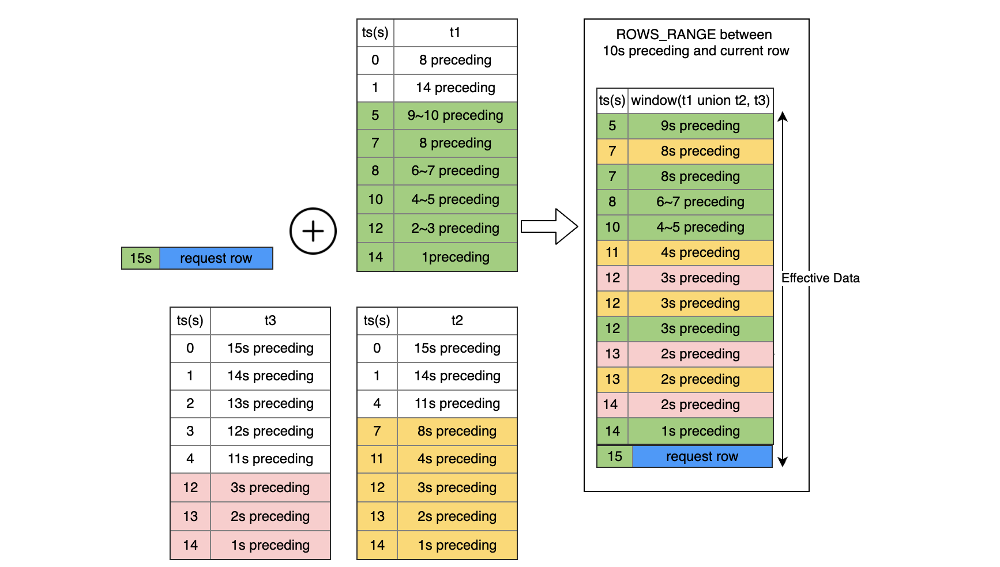
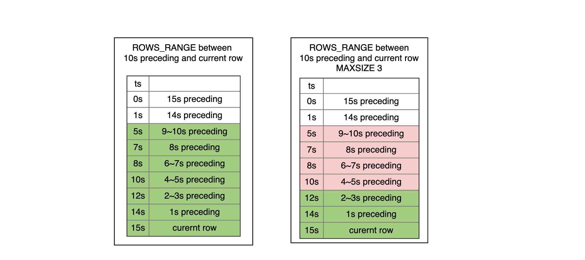

# WINDOW Clause

## Syntax

```sql
WindowClauseOptional
         ::= ( 'WINDOW' WindowDefinition ( ',' WindowDefinition )* )?
WindowDefinition
         ::= WindowName 'AS' WindowSpec

WindowSpec
         ::= '(' WindowSpecDetails ')'   
         
WindowSpecDetails
         ::= [ExistingWindowName] [WindowUnionClause] WindowPartitionClause WindowOrderByClause WindowFrameClause [WindowExcludeCurrentTime] [WindowInstanceNotInWindow]


WindowUnionClause
				 :: = ( 'UNION' TableRefs)

WindowPartitionClause
         ::= ( 'PARTITION' 'BY' ByList ) 

WindowOrderByClause
         ::= ( 'ORDER' 'BY' ByList )    


WindowFrameClause
         ::= ( WindowFrameUnits WindowFrameExtent [WindowFrameMaxSize]) 

WindowFrameUnits
         ::= 'ROWS'
           | 'ROWS_RANGE'         

WindowFrameExtent
         ::= WindowFrameStart
           | WindowFrameBetween
WindowFrameStart
         ::= ( 'UNBOUNDED' | NumLiteral | IntervalLiteral ) ['OPEN'] 'PRECEDING'
           | 'CURRENT' 'ROW'
WindowFrameBetween
         ::= 'BETWEEN' WindowFrameBound 'AND' WindowFrameBound
WindowFrameBound
         ::= WindowFrameStart
           | ( 'UNBOUNDED' | NumLiteral | IntervalLiteral ) ['OPEN'] 'FOLLOWING'  
           
WindowExcludeCurrentTime 
				::= 'EXCLUDE' 'CURRENT_TIME'      

WindowInstanceNotInWindow
				:: = 'INSTANCE_NOT_IN_WINDOW'
```

*窗口调用函数*实现了类似于聚合函数的功能。 不同的是，窗口调用函数不需要将查询结果打包成一行输出—在查询输出中，每一行都是分开的。 然而，窗口调用函数可以扫描所有的行，根据窗口调用函数的分组规范(`PARTITION BY`列)， 这些行可能会是当前行所在组的一部分。一个窗口调用函数的语法是下列之一：

```
function_name ([expression [, expression ... ]]) OVER ( window_definition )
function_name ([expression [, expression ... ]]) OVER window_name
function_name ( * ) OVER ( window_definition )
function_name ( * ) OVER window_name
```

## SQL语句模版

- ROWS WINDOW SQL模版

```sqlite
SELECT select_expr [, select_expr ...], window_function_name(expr) OVER window_name, ... FROM ... WINDOW AS window_name (PARTITION BY ... ORDER BY ... ROWS BETWEEN ... AND ...)

```

- ROWS RANGE WINDOW SQL模版

```sql
SELECT select_expr [,select_expr...], window_function_name(expr) OVER window_name, ... FROM ... WINDOW AS window_name (PARTITION BY ... ORDER BY ... ROWS_RANEG BETWEEN ... AND ...)
```

## 边界说明

| SELECT语句元素 | 状态                   | 说明                                                         |
| :------------- | ---------------------- | :----------------------------------------------------------- |
| WINDOW Clause  | Online Training 不支持 | 窗口子句用于定义一个或者若干个窗口。窗口可以是有名或者匿名的。用户可以在窗口上调用聚合函数来进行一些分析型计算的操作（```sql agg_func() over window_name```)。<br />OpenMLDB目前仅支持历史窗口，不支持未来窗口（即不支持`FOLLOWING`类型的窗口边界）。<br />OpenMLDB的窗口仅支持`PARTITION BY`列，不支持`PARTITION BY`运算或者函数表达式。<br />OpenMLDB的窗口仅支持`ORDER BY`列，不支持`ORDER BY`运算或者函数表达式。<br />在Online Serving时，需要遵循[3.2 Online Serving下Window的使用规范](../deployment_manage/ONLINE_SERVING_REQUIREMENTS.md#online-serving下window的使用规范) |

## 基本的WINDOW SPEC语法元素

### Window Partition Clause 和 Window OrderBy Clause

```sql
WindowPartitionClause
         ::= ( 'PARTITION' 'BY' ByList )

WindowOrderByClause
         ::= ( 'ORDER' 'BY' ByList )            
```

`PARTITION BY`选项将查询的行分为一组进入*partitions*， 这些行在窗口函数中单独处理。`PARTITION BY`和查询级别`GROUP BY` 子句做相似的工作，除了它的表达式只能作为表达式不能作为输出列的名字或数。OpenMLDB要求必须配置`PARTITION BY`。并且目前**仅支持按列分组**，无法支持按运算和函数表达式分组。

`ORDER BY` 选项决定分区中的行被窗口函数处理的顺序。它和查询级别`ORDER BY`子句做相似的工作， 但是同样的它不能作为输出列的名字或数。同样，OpenMLDB要求必须配置`ORDER BY`。并且目前**仅支持按列排序**，无法支持按运算和函数表达式排序。

### Window Frame Units

```sql
WindowFrameUnits
         ::= 'ROWS'
           | 'ROWS_RANGE' 
```

WindowFrameUnits定义了窗口的框架类型。OpenMLDB支持两类窗口框架：ROWS和ROWS_RANGE

SQL标准的RANGE类窗口OpenMLDB系统目前暂不支持。他们直接的对比差异如下图所示


- ROWS: 窗口按行划入窗口，根据条数滑出窗口
- ROWS_RANGE：窗口按行划入窗口，根据时间区间滑出窗口
- RANGE: 窗口按时间粒度划入窗口（一次可能滑入多条同一时刻的数据行），按时间区间滑出窗口

### Window Frame Extent

```sql
WindowFrameExtent
         ::= WindowFrameStart
           | WindowFrameBetween
WindowFrameBetween
         ::= 'BETWEEN' WindowFrameBound 'AND' WindowFrameBound
WindowFrameBound
         ::= ( 'UNBOUNDED' | NumLiteral | IntervalLiteral ) ['OPEN'] 'PRECEDING'
           | 'CURRENT' 'ROW'
```

 **WindowFrameExtent**定义了窗口的上界和下界。框架类型可以用 `ROWS`或`ROWS_RANGE`声明；

- CURRENT ROW: 表示当前行
- UNBOUNDED PRECEDING: 表示无限制上界
- `expr` PRECEDING
  - 窗口类型为ROWS时，`expr`必须为一个正整数。它表示边界为当前行往前`expr`行。
  - 窗口类型为ROWS_RANGE时,`expr`一般为时间区间（例如`10s`, `10m`,`10h`, `10d`)，它表示边界为当前行往前移expr时间段（例如，10秒，10分钟，10小时，10天）
- OpenMLDB支持默认边界是闭合的。但支持OPEN关键字来修饰边界开区间
- 请注意：标准SQL中，还支持FOLLOWING的边界，当OpenMLDB并不支持。

#### **Example: 有名窗口（Named Window）**

```SQL
SELECT sum(col2) OVER w1 as w1_col2_sum FROM t1
WINDOW w1 AS (PARTITION BY col1 ORDER BY col5 ROWS BETWEEN 3 PRECEDING AND CURRENT ROW)
```

#### **Example: 匿名窗口**

```SQL
SELECT id, pk1, col1, std_ts,
sum(col1) OVER (PARTITION BY pk1 ORDER BY std_ts ROWS BETWEEN 1 PRECEDING AND CURRENT ROW) as w1_col1_sum
from t1;
```

#### **Example: ROWS窗口**

```SQL
-- ROWS example
-- desc: window ROWS, 前1000条到当前条
SELECT sum(col2) OVER w1 as w1_col2_sum FROM t1
WINDOW w1 AS (PARTITION BY col1 ORDER BY col5 ROWS BETWEEN 1000 PRECEDING AND CURRENT ROW);
```
#### **Example: ROWS RANGE窗口**

```SQL
-- ROWS example
-- desc: window ROWS_RANGE, 前10s到当前条
SELECT sum(col2) OVER w1 as w1_col2_sum FROM t1
WINDOW w1 AS (PARTITION BY col1 ORDER BY col5 ROWS_RANGE BETWEEN 10s PRECEDING AND CURRENT ROW);
```

## OpenMLDB特有的WINDOW SPEC元素

### Window With Union

```sql
WindowUnionClause
				 :: = ( 'UNION' TableRefs)
```

#### **Example: Window with union 一张副表**

```SQL
SELECT col1, col5, sum(col2) OVER w1 as w1_col2_sum FROM t1
WINDOW w1 AS (UNION t2 PARTITION BY col1 ORDER BY col5 ROWS_RANGE BETWEEN 10s PRECEDING AND CURRENT ROW)f;
```


#### **Example: Window with union 多张副表**

```SQL
SELECT col1, col5, sum(col2) OVER w1 as w1_col2_sum FROM t1
WINDOW w1 AS (UNION t2, t3 PARTITION BY col1 ORDER BY col5 ROWS_RANGE BETWEEN 10s PRECEDING AND CURRENT ROW);
```



#### **Example: Window with union 样本表不进入窗口**

```SQL
SELECT col1, col5, sum(col2) OVER w1 as w1_col2_sum FROM t1
WINDOW w1 AS (UNION t2 PARTITION BY col1 ORDER BY col5 ROWS BETWEEN 10s PRECEDING AND CURRENT ROW INSTANCE_NOT_IN_WINDOW);
```


#### **Example: Window with union 列筛选子查询**

```SQL
SELECT col1, col5, sum(col2) OVER w1 as w1_col2_sum FROM t1
WINDOW w1 AS
(UNION (select c1 as col1, c2 as col2, 0.0 as col3, 0.0 as col4, c5 as col5, "NA" as col6 from t2),
(select c1 as col1, c2 as col2, 0.0 as col3, 0.0 as col4, c5 as col5, "NA" as col6 from t3)
PARTITION BY col1 ORDER BY col5 ROWS_RANGE BETWEEN 10s PRECEDING AND CURRENT ROW);
```

### Window Exclude Current Time

```
WindowExcludeCurrentTime 
				::= 'EXCLUDE' 'CURRENT_TIME'  
```

#### **Example: ROWS窗口EXCLUDE CURRENT TIME**

```SQL
-- ROWS example
-- desc: window ROWS, 前1000条到当前条, 除了current row以外窗口内不包含当前时刻的其他数据
SELECT sum(col2) OVER w1 as w1_col2_sum FROM t1
WINDOW w1 AS (PARTITION BY col1 ORDER BY col5 ROWS BETWEEN 1000 PRECEDING AND CURRENT ROW EXCLUDE CURRENT_TIME);
```

#### **Example: ROW RANGE窗口EXCLUDE CURRENT TIME**

```SQL
-- ROWS example
-- desc: window ROWS, 前10s到当前条，除了current row以外窗口内不包含当前时刻的其他数据
SELECT sum(col2) OVER w1 as w1_col2_sum FROM t1
WINDOW w1 AS (PARTITION BY col1 ORDER BY col5 ROWS_RANGE BETWEEN 10s PRECEDING AND CURRENT ROW EXCLUDE CURRENT_TIME);
```


### Window Frame Max Size

OpenMLDB在定义了元素，来限定窗口内条数。具体来说，可以在窗口定义里使用**MAXSIZE**关键字，来限制window内允许的有效窗口内最大数据条数。

```sql
WindowFrameMaxSize
				:: = MAXSIZE NumLiteral
```



#### **Example: ROW RANGE 窗口MAXSIZE**

```sql
-- ROWS example
-- desc: window ROWS_RANGE, 前10s到当前条，同时限制窗口条数不超过3条
SELECT sum(col2) OVER w1 as w1_col2_sum FROM t1
WINDOW w1 AS (PARTITION BY col1 ORDER BY col5 ROWS_RANGE BETWEEN 10s PRECEDING AND CURRENT ROW MAXSIZE 3);
```

