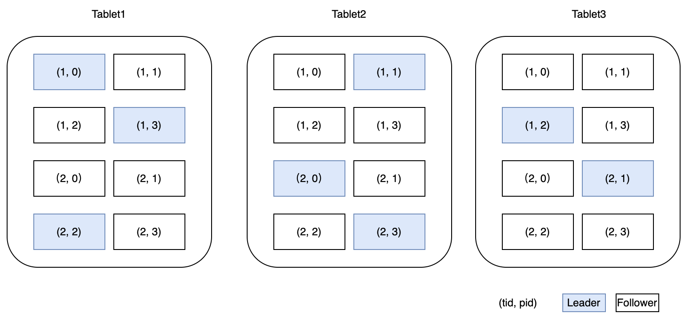
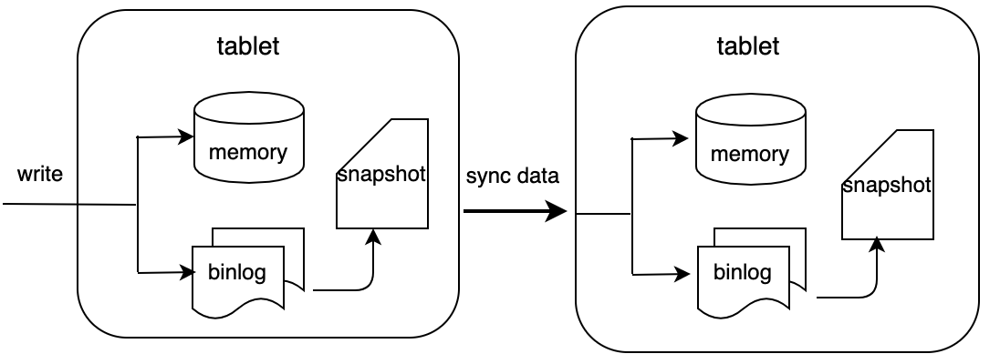

# OpenMLDB在线架构介绍

OpenMLDB的整体架构如下：

## Zookeeper
OpenMLDB依赖[Zookeeper](https://zookeeper.apache.org/)做服务发现和元数据存储。

## Nameserver

## Tablet

### Hybridse执行引擎

### 存储引擎
#### 数据分布
和MySQL类似，在OpenMLDB中也有database和table。一张table必须关联到一个database中，一个database可以创建多张表。OpenMLDB是一个分布式的数据库，一张表的数据会分布在不同的节点中。一张表分为多个分片(Partition)，默认为8个，也可以在创建表时指定。分片是存储引擎主从同步以及扩缩容的最小单位。如下图所示，一张表的多个分片分布在不同节点上，一个节点上既有主分片又有从分片。(分片内部的数据存储在后续博文中会专门介绍)

读写数据时通过哈希函数计算要访问哪个分片。

#### 数据持久化及主从同步
OpenMLDB的在线数据全部保存在内存中，为了实现高可用会把数据持久化到硬盘中。

服务端收到SDK的写请求后会写内存和binlog。binlog是用来做主从同步的，数据写到binlog后会有一个后台线程异步的把数据从binlog中读出来然后同步到从节点中。从节点收到同步请求后同样是写内存和binlog。  
snapshot可以看作是内存数据的一个镜像，不过出于性能考虑，snapshot并不是从内存dump出来，而是由binlog和上一个snapshot合并生成。在合并的过程中会删除掉过期的数据。OpenMLDB会记录主从同步和合并到snapshot中的offset, 如果一个binlog文件中的数据全部被同步到从节点并且也合并到了snapshot中，这个binlog文件就会被后台线程删除。
## APIServer
APIServer是提供Restful API接口的模块。如果在实际场景中不会使用restful的方式访问OpenMLDB，部署时就不需要部署APIServer。APIServer收到http请求后会解析请求中的参数，然后通过内置的SDK用RPC的方式去访问OpenMLDB，然后封装数据返回給调用方。相比直接用SDK访问，通过APIServer会多一次请求转发和编解码，性能上会有一定损耗。
